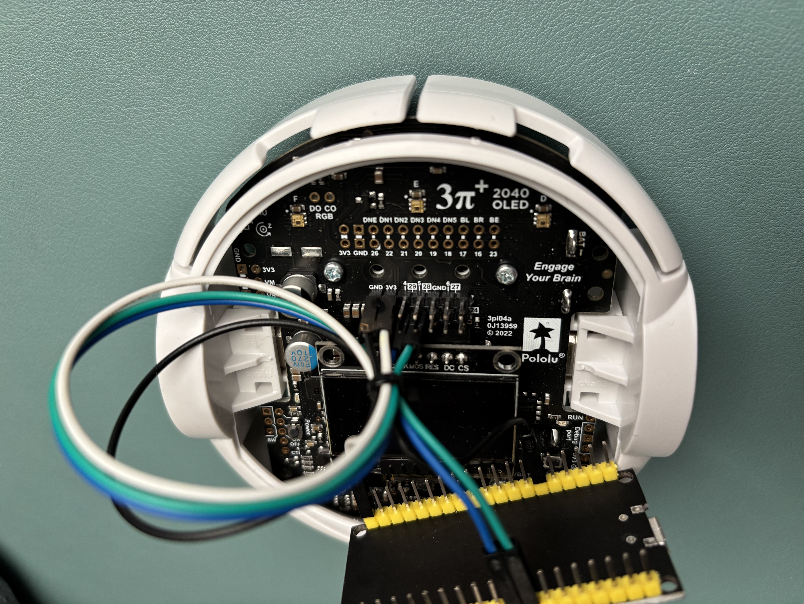

# ESP32-3pi+2040 Communication Project

This project demonstrates how to establish communication between an ESP32 microcontroller and a Pololu 3pi+ 2040 robot. It enables remote control of the 3pi+ 2040 through a network connection using simple commands.

## Project Overview

The project implements a network-based control system where an ESP32 acts as a bridge between a computer and the 3pi+ 2040 robot. Users can send commands through a network connection to control various functions of the robot.

## Hardware Setup

### Required Components
- ESP32-WROOM-32 Development Board
- Pololu 3pi+ 2040 Robot
- Jumper Wires
- USB Cable for programming

### Pin Connections
The following connections are required between the ESP32 and 3pi+ 2040:

| 3pi+ 2040 Pin | ESP32 Pin |
|---------------|-----------|
| Pin 29 (TX)   | GPIO 17   |
| Pin 28 (RX)   | GPIO 18   |
| GND           | GND       |
| 3.3V          | 3.3V      |

### Connection Images

#### ESP32 Connection

*ESP32-WROOM-32 board with UART connections*

#### Pololu 3pi+ Connection

*Pololu 3pi+ 2040 board showing the connection points*

## Software Implementation

### Main Components
1. `main.py`: Handles the ESP32's network connectivity and command processing
2. `communication.py`: Implements the communication protocol between ESP32 and 3pi+ 2040

### Available Commands
The system currently supports the following commands:
- `LED_ON`: Turns on the robot's LEDs
- `LED_OFF`: Turns off the robot's LEDs
- `SPIN`: Makes the robot perform a spinning motion

### Usage
1. Power on the 3pi+ 2040 robot
2. Connect to the ESP32 using netcat:
   ```bash
   nc "IP_OF_ESP32" 1234
   ```
3. Enter any of the available commands

## Demonstration

Check out the project in action:

https://github.com/RaphaelKorb97/Pololu_ESP32/raw/main/result.mp4

## Project Structure
```
Pololu_ESP32/
├── main.py                    # Main ESP32 program
├── communication.py           # Communication protocol implementation
├── README.md                  # Project documentation
├── Pins_at_ESP32 2.jpeg      # ESP32 connection photo
├── Pins_at_pololu.jpeg       # Pololu connection photo
└── result.mp4                # Demonstration video
```

## Extending the Project
The command system can be easily extended by adding new commands to the communication protocol. The current implementation serves as a foundation for more complex robot control applications.

## License
This project is open-source and available for educational and personal use.

## Acknowledgments
Special thanks to:
- Pololu for their excellent robotics platform
- ESP32 community for their support
- All contributors and testers

---

For any questions or suggestions, please feel free to open an issue or submit a pull request.


